# Python协同过滤算法个性化新闻推荐系统

#### 介绍

Python协同过滤算法个性化在线新闻推荐网站系统，采用Python+Django+Mysql开发技术，基于用户、物品的协同过滤推荐算法，基于用户喜好标签，基于内容等多种混合推荐，事实在线计算推荐，同时采用爬虫技术收集新闻数据。

# 项目介绍

## 一、项目简介

## 1、开发工具和使用技术

Python3.8，Django3，mysql8，navicat数据库管理工具，html页面，javascript脚本，jquery脚本，bootstrap前端框架 ，layer弹窗组件、layui文件上传组件、kindeditor富文本框组件等。

## 2、实现功能

前台用户包含：注册、登录、注销、喜好标签、浏览新闻、搜索新闻、信息修改、密码修改、新闻评分、新闻收藏、新闻评论、热点榜单、热点推荐、个性化推荐新闻等功能；

后台管理员包含：数据统计、用户管理、新闻管理、新闻类 型管理、用户喜好标签管理、评分管理、收藏管理、评论管理、浏览记录管理等。

## 个性化推荐功能：

## 热点榜单：查询浏览数量最多的新闻，同时不包括当前登录用户浏览过的新闻；

## 个性化推荐：

## 游客：热点推荐（根据新闻总评分和总收藏数量降序推荐）

## 登录用户：基于用户的协同过滤推荐算法（根据评分数据），

如果没有推荐结果，采用热点推荐（根据登录用户喜好标签下的新闻的总评分降序推荐，同时是登录用户没有评分的）；
基于项目的协同过滤推荐算法（根据收藏数据），
如果没有推荐结果，采用热点推荐（根据登录用户喜好标签下的新闻的收藏数量降序推荐，同时是登录用户没有收藏的）。

## 猜你喜欢：

与当前新闻相同类型且评分较高的新闻，同时是当前用户没有评分的新闻。

## 新闻数据来源：环球日报新闻数据

## 3、开发步骤

## 一、需求分析

主要是分析需要实现的功能、确定开发工具及技术等。例如：前台用户需要有登录、注册、注销、搜索新闻、新闻评分、个性化推荐等，后台管理员需要有登录、注销、用户管理、新闻管理、新闻类型管理等，个性化推荐使用基于用户的协同过滤推荐算法等。Python开发语言，mysql数据库，django开发框架等。

## 二、数据库设计

数据库设计使用navicat数据库管理工具，可通过sql语句脚本生成数据库表，也可以直接操作新建表设计表等。注意主外键关联设计，例如：评分记录表需要外键关联用户表和新闻表。

## 三、页面设计

使用bootstrap前端框架

## 四、开发框架搭建

Django开发框架搭建请参考：使用pycharm创建django项目讲解.doc

## 五、功能开发

首先是进行前台用户首页的开发，其次是新闻详情，然后是用户注册、登录等，接着是用户的评分、修改信息等，然后是进行管理员功能的开发，最后是进行前台用户的个性化推荐功能实现。
## 六、系统测试

主要是进行bug修改，推荐算法测试。

## 七、系统功能展示
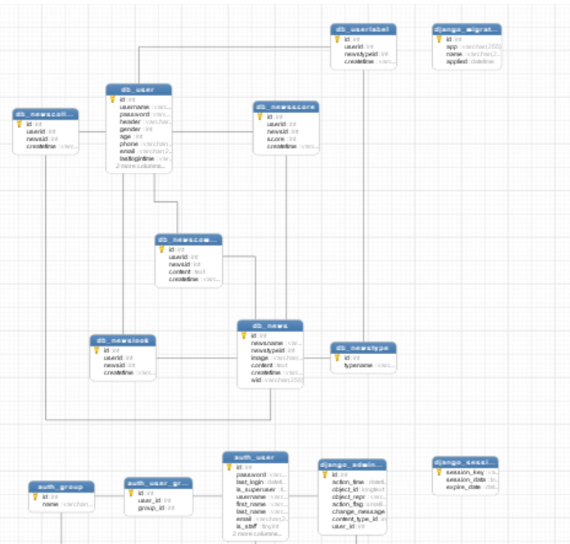
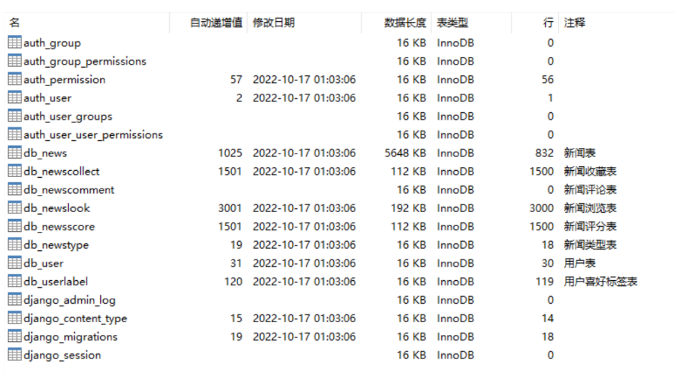
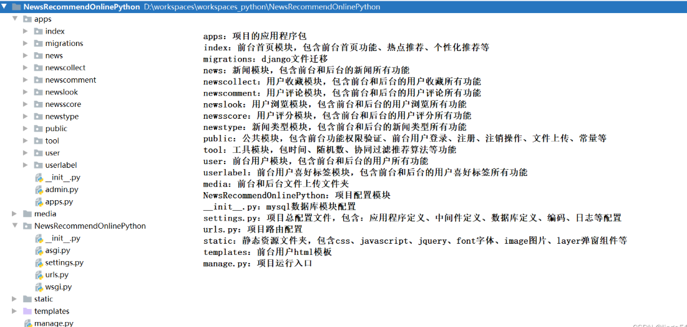
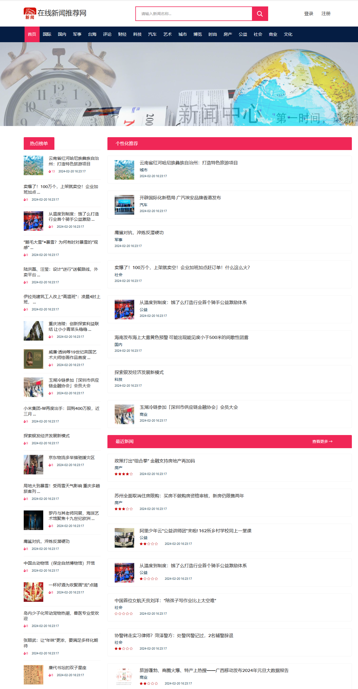
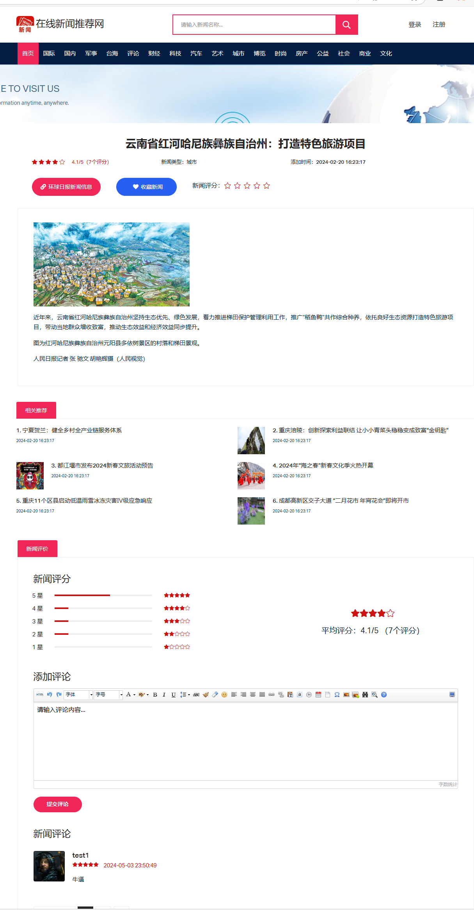

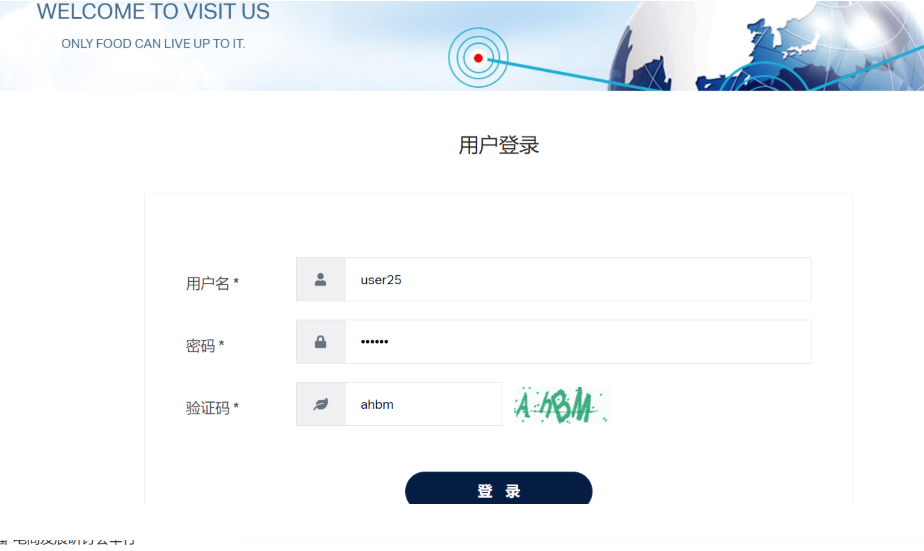
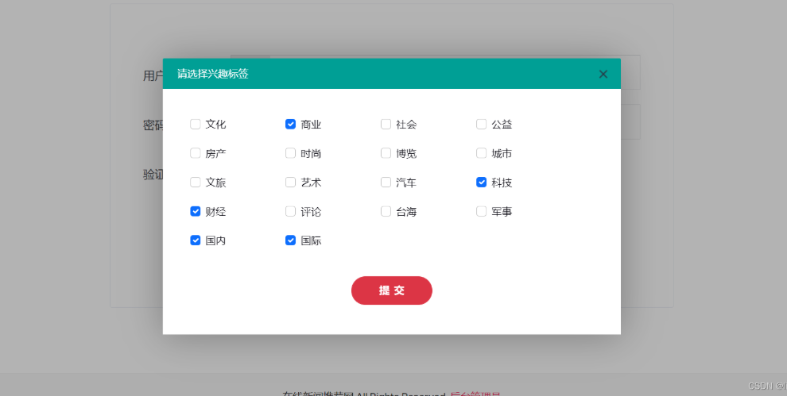

## 后台管理系统
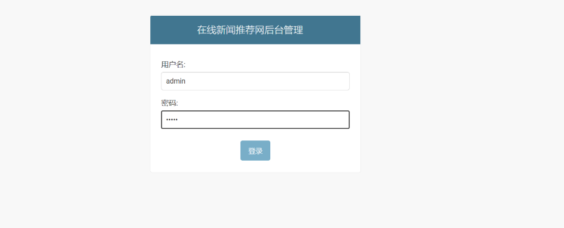
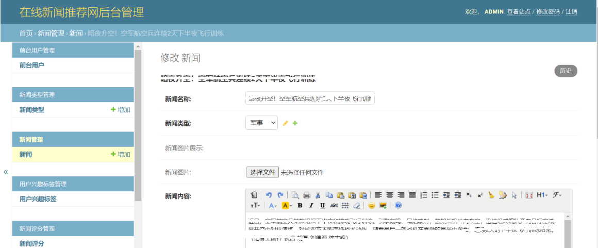
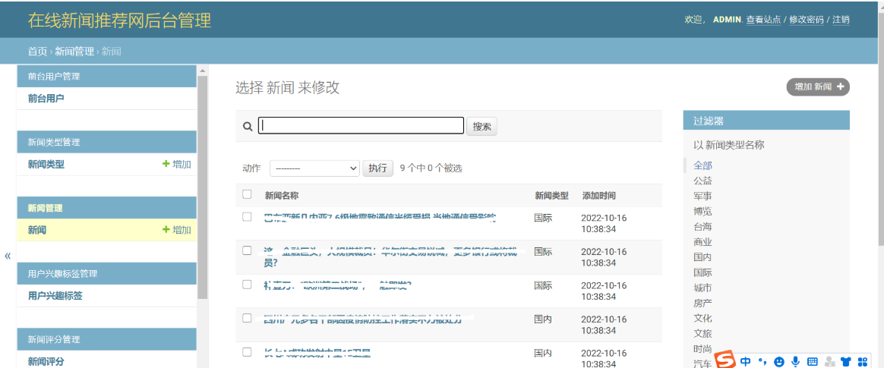
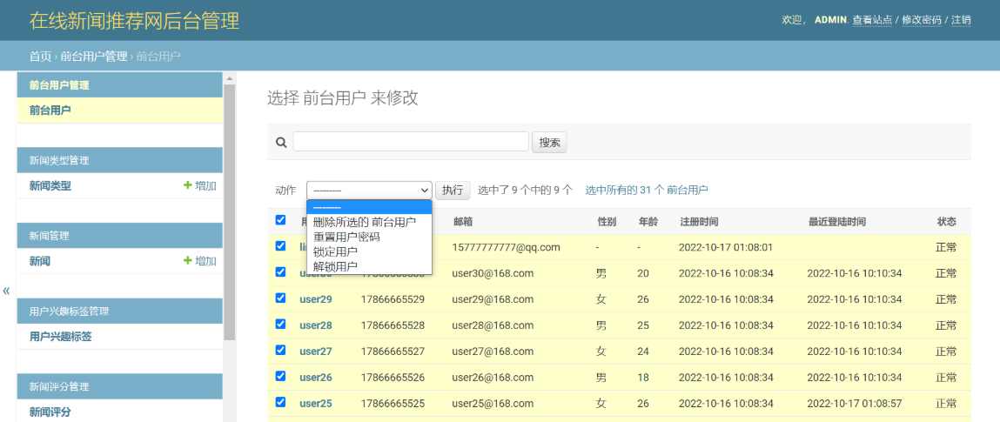

## 推荐算法展示
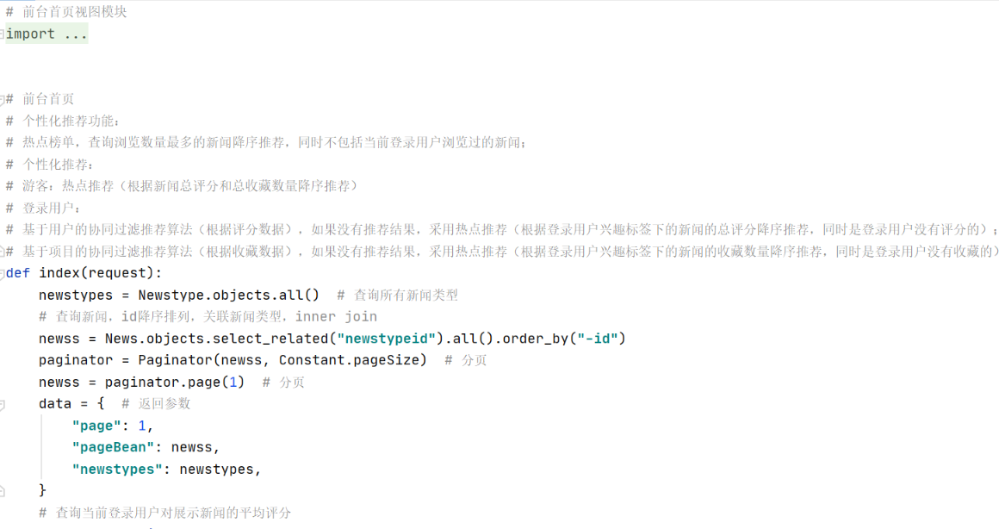
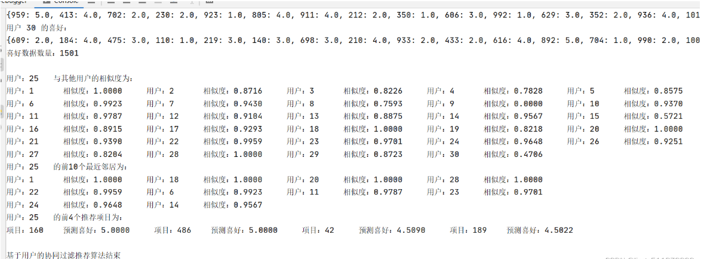
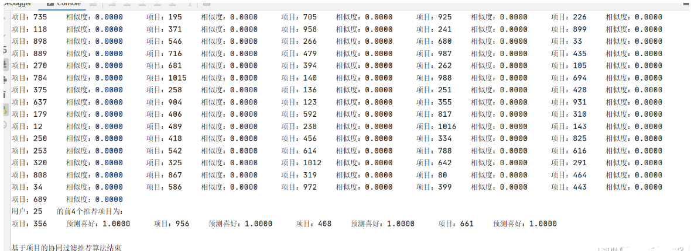
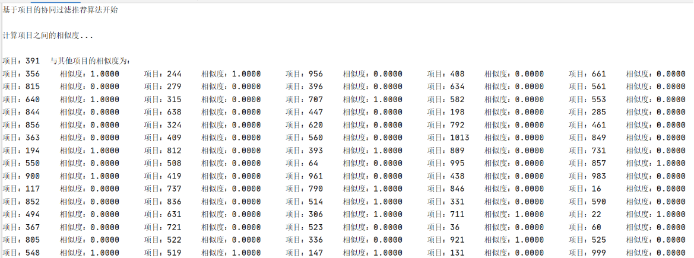
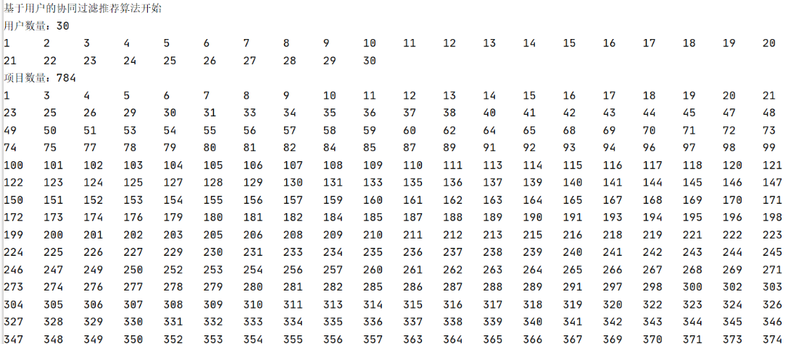